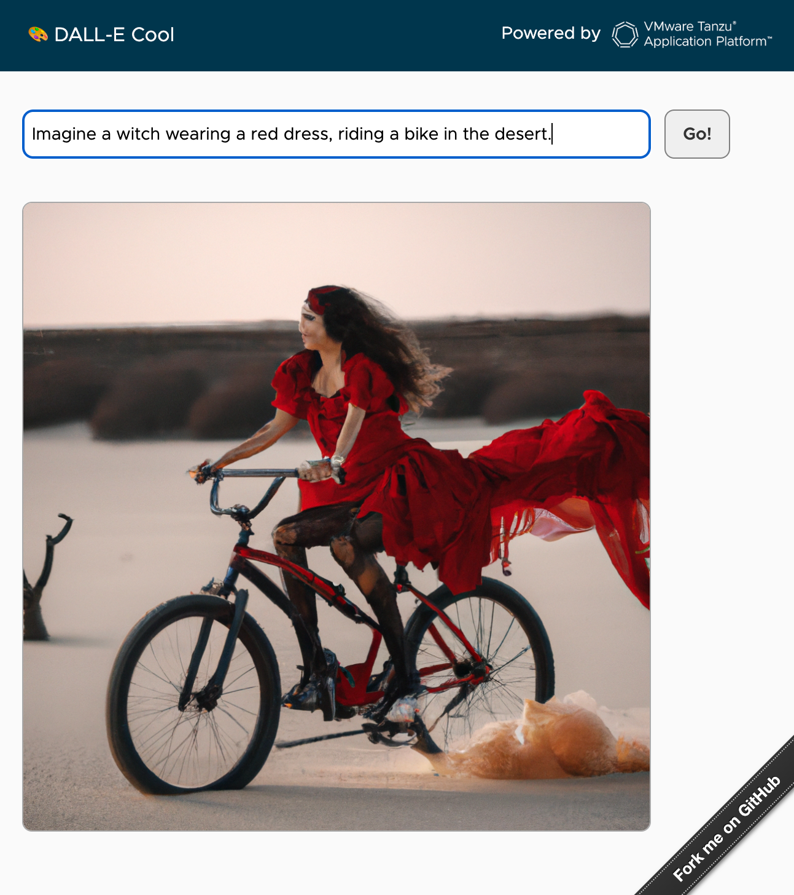

Welcome to DALL-E Cool!

This is a simple [Spring Boot 3](https://spring.io/projects/spring-boot) app,
generating images by leveraging [DALL-E](https://openai.com/product/dall-e-2)
(an OpenAI project).

Just enter some text, hit `Go`, and you get an image generated by AI.

This app is best used with [VMware Tanzu Application Platform](https://tanzu.vmware.com/application-platform)
(TAP): a platform to build and run your app on top of any Kubernetes distribution.
You can also deploy this app without TAP, but then you'll have to write a Dockerfile to create a container,
and write some YAML files to deploy the app to your Kubernetes cluster.

## How to use it?

You need an API key from OpenAI in order to use DALL-E.

[Sign up for a free account](https://platform.openai.com/overview)
and [get an API key](https://platform.openai.com/account/api-keys).

### Run on your workstation

Just run this command:

```shell
OPENAI_KEY=my-openai-api-key mvn spring-boot:run
```

The OpenAI API key is actually read from the property `openai.key`.
In this command, Spring Boot would use an environment variable to populate this property. 

The app is available at http://localhost:8080.

Enter some text and hit `Go`: an image will be generated by DALL-E.

### Deploy the app to TAP

This app relies on [servicebinding.io](https://servicebinding.io/)
to load the OpenAI API key.

As a developer, you don't have to deal with sensitive data: it's up to the app operator
to provide you with such things.

Create a Kubernetes secret to store your API key, [by using this template](config/app-operator/openai-binding.yaml.template):

```yaml
apiVersion: v1
kind: Secret
metadata:
  name: openai-binding
type: servicebinding.io/openai
stringData:
  type: openai
  provider: sample
  key: my-openai-api-key
```

Note the use of `type: openai`. This value is used by
[a custom service binding processor implementation](src/main/java/com/vmware/tanzu/demos/dallecool/OpenAiBindingsPropertiesProcessor.java)
to set the `openai.key` property:

```java
public class OpenAiBindingsPropertiesProcessor implements BindingsPropertiesProcessor {
    public static final String TYPE = "openai";

    @Override
    public void process(Environment environment, Bindings bindings, Map<String, Object> properties) {
        bindings.filterBindings(TYPE).forEach(binding -> {
            properties.putIfAbsent("openai.key", binding.getSecret().get("key"));
        });
    }
}
```

Usually, you rely on service bindings to connect your app to some database, message broker, etc.
In this app, a custom service binding processor takes care of setting up the configuration for you.

Apply this configuration to the cluster:

```shell
kubectl -n $TAP_NS apply -f config/app-operator
```

The OpenAI API key is now available as a service binding. 

As a developer, deploy this app to TAP:

```shell
tanzu apps workload apply -f config/workload.yaml -n $TAP_NS
```

You're done!

Get the URL to access the app:

```shell
tanzu apps workload get dallecool -n $TAP_NS
```

```shell
🚢 Knative Services
   NAME        READY   URL
   dallecool   Ready   https://dallecool.dev.apps.corp.com
```

Enjoy!

## Contribute

Contributions are always welcome!

Feel free to open issues & send PR.

## License

Copyright &copy; 2023 [VMware, Inc. or its affiliates](https://vmware.com).

This project is licensed under the [Apache Software License version 2.0](https://www.apache.org/licenses/LICENSE-2.0).
